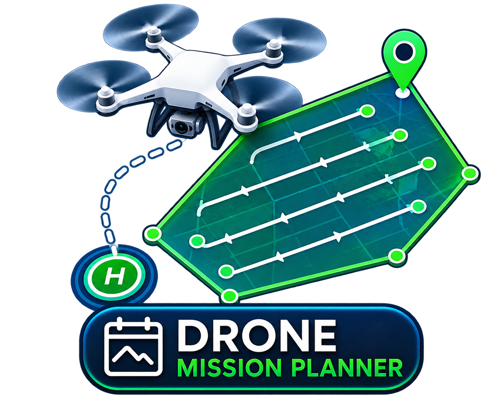

<p align="center">
  
</p>

# Drone Mission Planner — v1.3

A desktop tool for planning DJI waypoint missions — grid surveys, corridors, orbits,
manual routes — that actually imports KML/KMZ properly and exports missions DJI Fly
will load without a fight. Inspired by YMapper.

New in v1.3: exported missions now carry a complete `template.kml`, so DJI Fly honours
the turn style and heading you actually chose instead of silently substituting its own
defaults — this fixes aircraft that flew through waypoints without stopping, and the
spurious yaw at each waypoint. Also new: a wind forecast for your flight date and
location, with guidance on what the numbers mean for a survey.


---

## What it does

**Import** — KML and KMZ, parsed in a namespace-agnostic way so it doesn't choke on
nested `Folder`s, `MultiGeometry`, or whatever quirks Google Earth/QGIS/DJI's own tools
put in their output. Pulls out polygons, routes, and points, and you can snap new
drawing onto any of them while planning a mission, so a hand-drawn grid lines up exactly
with an imported boundary instead of eyeballing it.

**Four mission types**, all generating real, editable waypoints rather than an opaque
DJI "auto" pattern:

- **Grid survey** — draw or import a polygon, get a rotation-aware lawnmower pattern.
  Coverage is computed from exact scanline geometry, so rows begin and end precisely on
  the boundary at any site orientation (see *Coverage geometry*). Spacing comes from your
  camera's real sensor/focal geometry
  and your chosen overlap %, or you can just type an exact spacing in meters if the
  overlap-percentage math isn't how you think about it. Optional crosshatch (second pass
  at 90°) for sites where a single sweep direction leaves gaps, and an optional 3D
  mapping mode that flies the area twice — once nadir, once oblique — which is the same
  method DJI Terra and Pix4D document for actually capturing building facades instead of
  just rooftops.
- **Corridor** — draw or import a route, get a multi-pass flight path covering a
  configurable width either side of it. Passes are true offset copies of the route with
  mitered corners, so they stay cleanly parallel through bends instead of kinking at
  every vertex, and the flight follows those bends rather than cutting across them. Good
  for roads, pipelines, rail, dig transects — anything linear.
- **Orbit** — click a center point, get a circular path at a fixed radius with the
  gimbal continuously tracking the center. Supports stacked rings at different altitudes
  for scanning a tall or complex object (tower, silo, monument) from more than one
  elevation angle, which a single ring can't do well.
- **Manual** — click to drop waypoints one at a time, each independently editable.

### Coverage geometry

Rows are built from **exact scanline intersections** with the survey polygon, not by
sampling a lattice of candidate points and testing each one. Every row therefore starts
and ends precisely on the boundary, whatever the shape or its rotation — a sampled
lattice left rows short by up to a full photo spacing wherever an edge wasn't parallel to
the sweep.

Coverage deliberately extends **half a line-spacing past the boundary**, evenly all the
way round. A survey boundary marks where the site ends, not a fence the aircraft must
stay inside of: a photo taken slightly past the edge is free extra coverage, whereas
stopping exactly on the edge leaves it with only half a photo footprint over it. That
margin is applied by genuinely dilating the polygon (a real mitered offset), and rows sit
at the **centres of equal bands** rather than on the extremes of the span. Both details
matter for rotated sites: the outermost point of a rotated shape is a corner rather than
an edge, and a row placed exactly there catches a zero-width slice and emits a stray
waypoint outside the area. Regression-tested at twenty orientations of the same site —
identical waypoint count, identical row count, no stray rows, and overshoot never
exceeding the margin.

**Auto-rotation** picks the sweep angle by estimated flight *time* (using the same
acceleration model as the rest of the app), not by bounding-box area. For a rectangle,
sweeping along the long edge and along the short edge produce identical bounding areas,
so an area-based choice is a coin flip that can land on many short passes instead of a
few long ones.

The live estimate runs this same geometry client-side, so its photo count, row count and
segment count match the generator exactly rather than approximating it.

### How grid/corridor missions actually fly (and why)

A grid or corridor mission does **not** put a real waypoint at every photo. Early
versions did, and real flight testing surfaced two problems at once: the aircraft
visibly hunting for position every time it stopped to "take" a photo (normal
position-hold behavior at that density, not a malfunction — but genuinely unpleasant to
watch and bad for image sharpness), and the RC2's own mission UI struggling once a
survey reached the waypoint counts that overlap/altitude settings produce trivially (a
modest survey can easily want thousands). Neither is a bug specific to this app —
independent reports (a Litchi forum thread, unrelated to this project) describe the same
RC2 instability on mapping missions with many closely-packed points, and DJI's own
consumer waypoint documentation only supports discrete stop-and-shoot camera actions, not
a continuous-flight interval trigger — that WPML mechanism exists but is documented as
enterprise-drone-only (M300/M350/M30/M3-series), not available on Mini/Air/Mavic-class
hardware.

What actually works, confirmed independently by [HOT's `drone-flightplan`](https://github.com/hotosm/drone-flightplan)
(a production tool used for real humanitarian drone mapping): put waypoints only at each
row's start and end, fly the row as one continuous straight line, and let the **camera's
own Timer/interval-shooting mode** — set manually on the controller before the flight,
since it can't be written into a WPML file — fire the shutter throughout. Cruise speed is
then *derived from* that fixed interval (`photo spacing ÷ camera interval`) rather than
the other way around, so a photo still lands roughly where it's supposed to. The app
tells you the exact interval and speed to set before every grid/corridor flight, in the
live estimate and again in the Waypoints tab. **This is a manual pre-flight step the app
cannot do for you — skip it and the mission still flies, it just won't take any
photos.** No-fly zones still work correctly with this: a zone cutting through a row
splits it into separate flyable segments instead of drawing a straight line through it.

That's the default ("Turn Only"), but it's a real tradeoff and not everyone wants to make
it every time, so both grid and corridor missions have a **Waypoint mode** toggle right in
their settings: **Turn Only** (above) or **Full** — a real stop-and-shoot waypoint at
every photo, no manual camera step needed, matching how a hand-made DJI Fly mission or a
small area survey behaves. Full mode is a legitimate choice for a small site where
waypoint count was never going to be a problem, or when you'd rather not touch the
camera's settings before flight — you're trading that convenience for the position-hold
jitter and RC2 waypoint-count risk Turn Only exists to avoid. Checked what other real
tools do here before building this: [YMapper](https://github.com/YarosMallorca/DJI-Mapper)
and Waypoint OS both expose the exact same choice, for the same reason.

Orbit and Manual missions are unaffected — their waypoints were always meant to be
individual shots, not a continuous strip, so they keep ordinary per-waypoint photo
actions.

Every generated mission shows a live estimate — photo count, area, flight time,
recommended shutter speed to avoid motion blur — **before** you commit to it, computed
by literally running the real generator client-side rather than a rough formula that
might disagree with what actually gets built.

Flight time accounts for acceleration, not just distance÷speed: the aircraft doesn't
teleport to cruise speed, and a short leg (the hop between two rows, for instance) can
mean it never gets there at all before decelerating again. A distance÷speed estimate
misses that and can undercount real flight time several times over; this one models the
accelerate/cruise/decelerate profile per leg (1.4 m/s² default, editable under Setup →
Aircraft & camera → Advanced, sourced from real acceleration-aware path-planning
research). It also feeds directly into "Export by Battery," so a mission that looked like
it fit on one battery under a flat estimate won't silently turn out not to — and that
same export step now also splits on waypoint count (DJI Fly's own 200-per-file cap on
current consumer drones, kept well clear of by default) whenever a mission needs it,
independent of battery life.

**Capture-purpose presets** set the gimbal angle (and matching overlap %) from published
sources instead of a guessed default: flat 2D mapping, vegetation/crop health, elevation/
DEM work (a slight oblique tilt breaks the "doming" distortion pure-nadir flights are
known to produce), 3D/building models, facade inspection, roof inspection, corridor
documentation. Each one names where the number came from. Picking the 3D-model preset
also turns on nadir + oblique double-grid capture automatically, rather than leaving that
as a separate step — a single oblique pass never images vertical surfaces like walls, so
the preset and the double-grid setting always move together instead of being two things
you can independently forget to match up.

Ground control points (placed under Site markup) pair with the elevation/DEM preset for
survey-grade accuracy in whatever SfM software (Agisoft Metashape, WebODM, Pix4D)
processes the photos afterward — this app doesn't do the 3D reconstruction itself, only
the flight planning and the GCP coordinate export.

**Battery-aware.** Rated flight times for the Mini 4 Pro, Mini 5 Pro, Air 3/3S, and
Mavic 3/3 Pro are built in, including the extended "Plus" batteries where they exist.
Rated minutes aren't what you actually get, though — real-world usable endurance runs
70–80% of the lab figure, and standard practice reserves 20–30% battery for
return-to-home. Both factors are editable, not hidden, and the app uses them to warn you
when a mission needs more than one battery and to split it into sequential,
correctly-named sub-missions on export if you ask it to.

**Auto-rotation.** One button aligns the grid sweep to the polygon's longest edge
(minimum-bounding-rectangle via rotating calipers, not a heuristic) instead of you
dragging a slider by eye. A second button aligns it to the wind instead, if you know it:
enter the direction the wind is coming *from* and the sweep rotates so the long passes
run parallel to that axis rather than across it — coverage-path research on UAV surveys
in wind (boustrophedon patterns specifically) finds that flying with/against the wind
holds a steadier ground speed than a sweep that has to fight a crosswind on every pass.

**Turn style**, per mission type, because "how the drone actually flies between
waypoints" turns out to be its own decision, not just a byproduct of the waypoints
themselves. DJI Fly supports stopping and rotating in place at each waypoint, or a smooth
continuous-curvature turn (a centripetal Catmull-Rom spline through the points) that
never fully stops. Grid/corridor missions default to stop-at-each-point, matching what
Pix4D/UgCS/DJI Terra all recommend for photogrammetry — a spline turn keeps drifting
gimbal position and ground speed through the corner, which is exactly what you don't want
when every photo needs a consistent, known camera position. Orbits default the other way:
a circular path built from stop-and-rotate segments flies a stuttering many-sided polygon
instead of a circle, so orbit missions use the smooth spline mode by default, which is
what actually produces a circular flight path. Both are overridable per mission type.

**No-fly / exclusion zones.** Draw a hole (a building, a hazard, restricted airspace)
and grid, corridor, and overview-lap coverage all skip it instead of flying straight over
it — crosshatch and 3D-mapping included. Rows are cut at the zone's exact boundary (any
zone width, however narrow), the remaining stretches are grouped into connected cells so
the aircraft finishes one side before starting the other, and the finished path is
**routed around** each zone. That last step matters: splitting rows keeps photos out of a
zone but says nothing about the straight legs *between* stretches, which is where a path
otherwise crosses one. Verified across sixteen area/zone layouts in both waypoint modes
with zero crossings. Nothing gets left out silently: if a zone would
actually remove waypoints from the mission you're generating, you're asked first, with a
count, and can choose to ignore the zone for that mission instead. A manually-placed
waypoint (Manual mode) inside a zone gets a warning instead — you clicked there on
purpose, so it's placed, not blocked. The live grid estimate honors zones exactly too —
it runs the same coverage math client-side, not an approximation, same as the rest of the
estimate. (Orbit missions aren't affected — a fixed-radius circle around a point isn't an
area-coverage sweep, so there's nothing for a zone to filter there.)

**Ground control points.** Drop reference markers on the map where you plan to place a
physical target, then — after the flight, once you've measured each one properly with RTK
GPS or a total station — enter its real latitude, longitude and **elevation**, tick
*Surveyed*, and export a `Label,Latitude,Longitude,Elevation,Surveyed,Notes` CSV.
Elevation is a required field for Pix4D/Metashape/WebODM alike: georeferencing needs
X/Y/Z, not just X/Y. Only a surveyed GCP is worth feeding to them; an unsurveyed one is a
planning placeholder. GCPs are never written into the flight-path export; DJI Fly would
try to fly to them if they were.

**Terrain-following altitude.** One button (in the Waypoints tab, after generating a
mission) looks up ground elevation under every waypoint from a free SRTM-derived
elevation API and shifts each altitude so real height above ground stays roughly
constant over sloped terrain, instead of a flat plane projected from the first waypoint.
DJI Fly's consumer app doesn't honor WPML's `aboveGroundLevel` height mode — that's a
Pilot 2 / FlightHub 2 / enterprise-drone feature — so this computes the offsets itself
and bakes them into ordinary `relativeToStartPoint` altitudes, the same approach
third-party planners like Litchi and Maven use to get terrain-following on consumer
drones. Needs internet access; SRTM data is ~30m resolution, so it's a real help on
hillsides, not a substitute for caution near sharp terrain features.

**Map layers** — Street, Satellite (Esri *and* Google, each with or without labels),
Topographic and Dark, switchable from a layer control, with imported layers, the flight
path, exclusion zones and ground control points as separate toggleable overlays.
Satellite resolution varies by region, so it's worth trying both providers over your
site. The Google layer uses their unofficial tile endpoint — no key, no SLA, outside
their terms of service, and it can be rate-limited or blocked without notice; it's the
same approach most hobby GIS and drone-planning tools take, and Esri is there as the
properly-licensed option.

**Find your site** — search any place or address from the map (free OpenStreetMap
geocoder, no API key), or jump straight to your current location.

**Mission replay** — play/pause/scrub through the generated mission on the map with a
moving marker, so you can sanity-check the flight path before you ever fly it.

**Flight weather.** Pick a flight date and hit *Get wind forecast* — the location comes
from the mission you're planning (grid centroid, corridor midpoint, orbit centre), so it's
the weather where you'll actually fly. You get hourly wind for that day as a colour-coded
strip, the calmest three-hour window, peak gusts, and a verdict measured against **your
drone's own rated wind resistance** (10.7 m/s for the Mini 4 Pro, 12 m/s for the Mini 5
Pro / Air 3 / Air 3S / Mavic 3 series — editable per drone). One button pushes the
forecast direction into *Align to wind* and rotates the grid to match.

Wind is read at the model level closest to your planning altitude (10, 80, 120 or 180 m)
rather than reporting ground wind as if it were flight wind — direction alone can differ
by tens of degrees between them. The advice is specific rather than generic: a tailwind
thins forward overlap, a headwind stacks up redundant frames, a crosswind is worst because
constant yaw correction misaligns images, and above roughly 8 m/s mapping quality degrades
well before safety does. Gusts are called out separately, since they're what actually
breaks altitude hold.

Two things it tells you plainly: **anything past today is a model estimate, not an
observation** — wind forecasts lose skill quickly with range, so treat a week out as a
rough planning hint and re-check on the morning — and the data comes from
[Open-Meteo](https://open-meteo.com/) (free, no account, CC-BY 4.0), a shared service, so
**fetch sparingly** rather than on every settings tweak. A forecast is never a substitute
for looking at the sky before you launch.

**Interactive tutorial.** A fourteen-step guided tour that dims the app and spotlights
each part in turn — mission types, drawing gestures, search, basemaps, KML import, no-fly
zones and GCPs, flight parameters, the tabs, live stats, export and upload, and a
pre-flight checklist. It's offered once on first launch and replayable any time from the
**Tutorial** button in the title bar.

**Undo / redo** — `Ctrl+Z` / `Ctrl+Y` (or the toolbar buttons) across drawing, generating,
imports, deletions and project loads.

**Drawing** — click to place, **right-click** (or Backspace) to undo the last point,
**double-click** or Enter to finish, Esc to cancel. The banner shows the traced perimeter
or length live as you go, and clicks snap onto imported KML/KMZ geometry. A drawn
boundary stays visible on the map after you finish it, as a reference against the
generated flight path.

**Export.** Every export is auto-named `{mission name}_{flight time}_{photo count}p_
{drone}.kmz` — you're prompted for the mission name at the start of each one, and can
rename it anytime in the Setup tab. The KMZ itself (`wpmz/template.kml` +
`wpmz/waylines.wpml`) is structured to match what DJI Fly's own parser actually accepts,
which is stricter and slightly different from the documented enterprise Cloud-API spec
built for DJI Pilot 2.

Projects save/load as plain `.json` so you can come back and keep editing a mission
later, or reuse a site's setup for a repeat survey.

---

## Requirements

- Windows 10 / 11
- [WebView2 Runtime](https://developer.microsoft.com/en-us/microsoft-edge/webview2/)
  (already on Windows 11; free download on Windows 10)

## Installation

**Run from source:**

```bash
pip install pywebview pywin32
python mission_planner.py
```

(`pywin32` is only needed for the "Upload to RC" button — the app runs fine without it,
that one button just won't work.)

**Or build a standalone EXE:** double-click `BUILD_EXE.bat`. `DroneMissionPlanner.exe`
shows up in the same folder afterward — no Python needed to run it from there.

## Usage

The app opens maximised and centred. The first time you run it, it asks which drone you
fly — sets the right camera and battery defaults from that, remembers it for next time
(in a small settings file in your home directory, so it survives updates), and it stays
editable later under Setup → Aircraft & camera. You'll also be offered the guided tour on
that first run.

1. Import a KML/KMZ, or draw an area/route/orbit center directly on the map.
2. Pick altitude, overlap, and (for grid missions) what you're actually trying to
   capture — the gimbal angle and overlap follow from that.
3. Check the live estimate, adjust anything, generate. Fine-tune individual waypoints in
   the Waypoints tab if needed — drag markers, edit altitude/speed/gimbal per point.
4. Export. If the mission needs more than one battery, use "Export by Battery" instead
   of the plain export to get it split automatically. Or skip exporting a file at all and
   hit **Upload to RC** to push the current mission straight to a connected controller.
5. If Upload to RC doesn't work for some reason, see the manual method below — it's not a
   simple drag-and-drop, DJI Fly is picky about this.

### Getting a mission onto a DJI RC / RC2

DJI Fly won't pick up an arbitrary KMZ dropped into its file system; it only recognizes
missions it created itself. The trick — same one **Upload to RC** automates — is: create
a throwaway waypoint mission in DJI Fly on the controller first, connect the RC to your
PC, then find that mission's folder and overwrite the file inside it.

**Upload to RC** does this over MTP (the same way Windows Explorer talks to the
controller — no extra driver needed beyond `pywin32`), and always asks first: it lists
every mission slot on the controller — modified time, waypoint count, and an approximate
location, each read straight from the mission file already sitting there — and you pick
which one gets replaced. It does **not** guess or auto-pick the newest one for you, and if
the current mission needs more than one battery it warns you up front rather than
uploading something the drone can't finish on one charge. Worth knowing: DJI Fly's own
mission title (the name you type when saving on the controller) isn't stored anywhere MTP
can reach, so it can't be shown here — nobody's found where Android/RC2 keeps it, unlike
iOS which has an accessible database for it. A live green-on-black log shows each step as
it happens, so if something goes wrong you can see exactly where.

It also replaces the mission's map-preview thumbnail on the controller (`waypoint/
map_preview/<uuid>/<uuid>.jpg`) with a drawn schematic of the actual route — not a
screenshot of the app's own map, since Leaflet's tiles can't be read back into an image
without the tile server's cooperation, and the waypoint markers are HTML, which no
screenshot approach can capture at all. The replace is verified byte-for-byte (not just
"did a copy command run") and specifically checks for a known MTP failure mode where a
delete that hasn't fully propagated causes the device to silently create a renamed
duplicate instead of overwriting — if that happens you'll get a clear error instead of a
silent no-op.

Even when the file replace is fully verified, though: **DJI Fly's mission-*list* view
appears to cache the thumbnail independent of the file on disk**, and doesn't reliably
notice an external file replace. It does correctly regenerate the thumbnail from the
mission's actual content the moment you open that mission in the waypoint editor, so the
real content is never wrong — it's specifically the *list* thumbnail, before you've
opened the mission, that can lag. If it's still showing the old picture, that's DJI Fly's
own app-level cache, not a failed upload — opening the mission, restarting DJI Fly, or
rebooting the controller forces it to catch up.

**ADB does not work for this on the RC2** — its `adbd` is present but firmware-hardened to
refuse real host connections, which is why `adb devices` shows it stuck "offline" forever
no matter what you try with cables, drivers, or developer-options toggling. That's
confirmed by independent reverse-engineering of the RC2, not a driver problem on your
end, so don't waste time chasing an ADB fix here.

If the upload dialog doesn't work, or you don't have `pywin32` installed, do it by hand:
connect over USB, browse to
`This PC \ DJI RC 2 \ Internal shared storage \ Android \ data \ dji.go.v5 \ files \
waypoint`, pick a mission subfolder — it's named with a GUID, and contains a `.kmz` file
sharing that same GUID as its filename — rename your exported mission to match that exact
filename, and overwrite it. Reopen the mission in DJI Fly and it loads your real
waypoints instead of the dummy ones.

Also: don't edit or re-save a mission from inside DJI Fly after importing it — it can
rewrite curved-turn missions in a way that breaks them, which is part of why this app
always exports straight-line, stop-at-waypoint turns rather than curved ones by default.

If a mission ever refuses to import, `Setup → Advanced` exposes the raw
`droneEnumValue`/`droneSubEnumValue` and sensor/focal-length values in case they need
overriding for your specific hardware/firmware combination.

## File structure

```
drone mission planner/
├── mission_planner.py    # the whole app
├── gen_icon.py           # rebuilds icon.ico from icon.png (run by the build script)
├── icon.png / icon.ico   # application icon
├── BUILD_EXE.bat         # Windows EXE builder
├── LICENSE
└── README.md
```

## Credits

Built with [pywebview](https://pywebview.flowrl.com/) (native window, embedded
browser), [Leaflet](https://leafletjs.com/) (the map), and tiles from
[OpenStreetMap](https://www.openstreetmap.org/), [Esri](https://www.esri.com/),
[OpenTopoMap](https://opentopomap.org/), and [CARTO](https://carto.com/). Wind
forecasts come from [Open-Meteo](https://open-meteo.com/) (CC-BY 4.0) and ground
elevation from [Open-Topo-Data](https://www.opentopodata.org/).

The DJI WPML export structure and the `droneEnumValue=68` value (undocumented for
consumer drones anywhere official) came from studying
[YLabs-FPV/YMapper](https://github.com/YLabs-FPV/YMapper) and
[fcsonline/droneroute](https://github.com/fcsonline/droneroute), both MIT-licensed —
real credit to both for the reverse-engineering legwork that made a working export
possible without DJI's cooperation.

Developed by **[praet0rian (mark0)](https://github.com/0xpraet0rian)**.

## License

GNU General Public License v3.0 — see [LICENSE](LICENSE). Copyright (C) 2026
praet0rian (mark0). This program comes with absolutely no warranty; see the license for
details.
